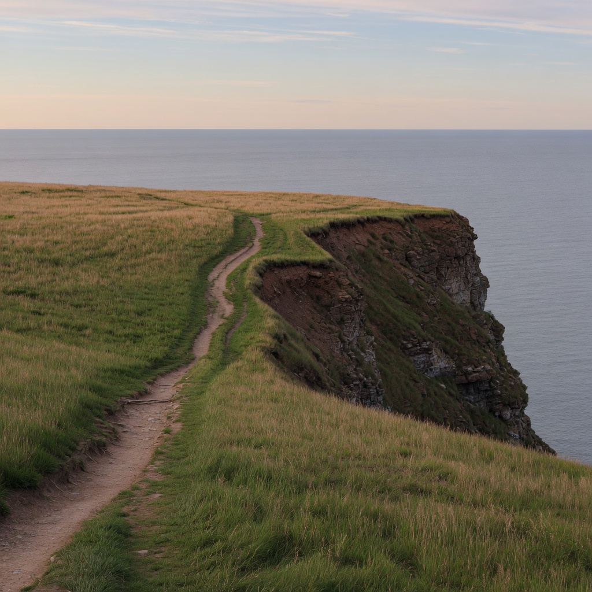

# observation obs_0003

## Metadata
- id: obs_0003
- source_type: generated
- study_id: [study_anchor_set_001](../studies/study_anchor_set_001.md)
- anchor_subject: anchor_landscape
- intended_vector: None
- intended_level: baseline
- seed: unavailable
- aspect_ratio: 1:1
- model: grok-imagine
- date: 2026-08-13

## Image


## Prompt
```
A grassy coastal cliff dropping to a calm gray-blue sea, late afternoon, a single dirt path in the lower left, no people, no buildings. Clear air, natural daylight. Clean contemporary landscape photograph: natural color, moderate contrast, sharp focus, no film effects, no glow, no added haze, no grain, no stylization. 35mm-equivalent, eye-level, horizon on the upper third, square 1:1 frame.
```

## Vector scores
| vector_id | score | confidence |
|---|---:|---:|
| [vec_optical_softness](../vectors/vec_optical_softness.md) | 0.18 | 0.72 |
| [vec_edge_softness](../vectors/vec_edge_softness.md) | 0.16 | 0.68 |
| [vec_microcontrast](../vectors/vec_microcontrast.md) | 0.64 | 0.70 |
| [vec_diffusion](../vectors/vec_diffusion.md) | 0.08 | 0.60 |
| [vec_halation](../vectors/vec_halation.md) | 0.04 | 0.70 |
| [vec_highlight_bloom](../vectors/vec_highlight_bloom.md) | 0.06 | 0.66 |
| [vec_bokeh_softness](../vectors/vec_bokeh_softness.md) | 0.10 | 0.55 |
| [vec_shadow_density](../vectors/vec_shadow_density.md) | 0.30 | 0.68 |
| [vec_black_level](../vectors/vec_black_level.md) | 0.22 | 0.60 |
| [vec_key_to_fill_ratio](../vectors/vec_key_to_fill_ratio.md) | 0.28 | 0.58 |
| [vec_source_hardness](../vectors/vec_source_hardness.md) | 0.32 | 0.55 |
| [vec_highlight_rolloff](../vectors/vec_highlight_rolloff.md) | 0.35 | 0.50 |

## Unintended changes
- none recorded

## Notes
Path sits more central than lower-left. Horizon and cliff lock hold. Baseline scores for the locked anchor.
