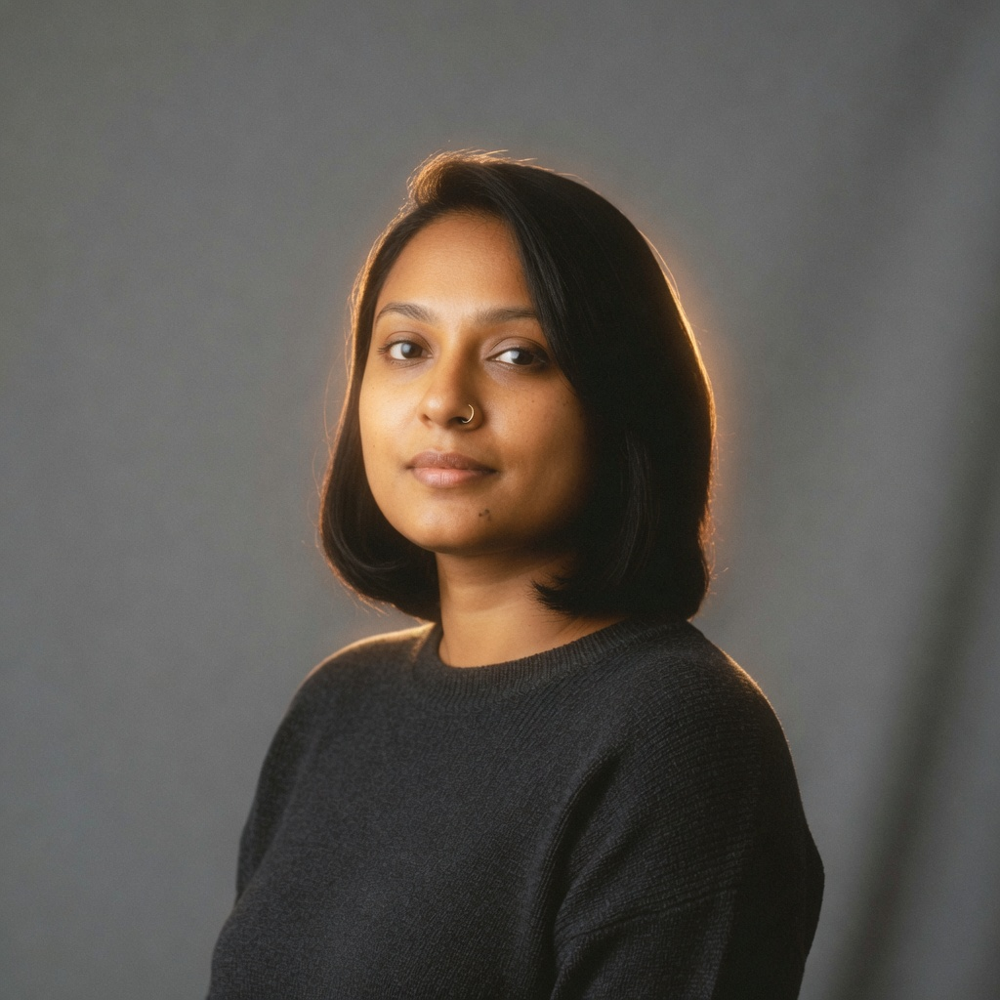

# observation obs_0038

## Metadata
- id: obs_0038
- source_type: generated
- study_id: [study_halation_001](../studies/study_halation_001.md)
- anchor_subject: anchor_portrait
- intended_vector: vec_halation
- intended_level: high
- seed: unavailable
- aspect_ratio: 1:1
- model: grok-imagine
- date: 2026-08-13

## Image


## Prompt
```
Preserve the same subject, identity, pose, framing, crop, camera position, and key-light direction. Do not change wardrobe, props, or scene content. Do not restyle the picture into a period look, a movie still, or a genre.  Change only halation. Set halation to: strong film-like halation, bright edges bleed into neighboring shadows, warm halo around lights. Do not globally soften the image, do not add grain, do not crush the whole tone scale, and do not change the subject's materials.
```

## Vector scores
| vector_id | score | confidence |
|---|---:|---:|
| [vec_halation](../vectors/vec_halation.md) | 0.58 | 0.60 |
| [vec_highlight_bloom](../vectors/vec_highlight_bloom.md) | 0.55 | 0.62 |
| [vec_optical_softness](../vectors/vec_optical_softness.md) | 0.31 | 0.55 |
| [vec_edge_softness](../vectors/vec_edge_softness.md) | 0.16 | 0.50 |
| [vec_microcontrast](../vectors/vec_microcontrast.md) | 0.58 | 0.48 |
| [vec_diffusion](../vectors/vec_diffusion.md) | 0.26 | 0.45 |
| [vec_shadow_density](../vectors/vec_shadow_density.md) | 0.30 | 0.45 |
| [vec_black_level](../vectors/vec_black_level.md) | 0.22 | 0.40 |
| [vec_key_to_fill_ratio](../vectors/vec_key_to_fill_ratio.md) | 0.40 | 0.48 |
| [vec_source_hardness](../vectors/vec_source_hardness.md) | 0.30 | 0.40 |
| [vec_bokeh_softness](../vectors/vec_bokeh_softness.md) | 0.08 | 0.35 |
| [vec_highlight_rolloff](../vectors/vec_highlight_rolloff.md) | 0.54 | 0.45 |

## Unintended changes
- warm halo around the hairline reads as invented rim light

## Notes
Intended halation high. Glow sits on the silhouette, not on existing speculars.
