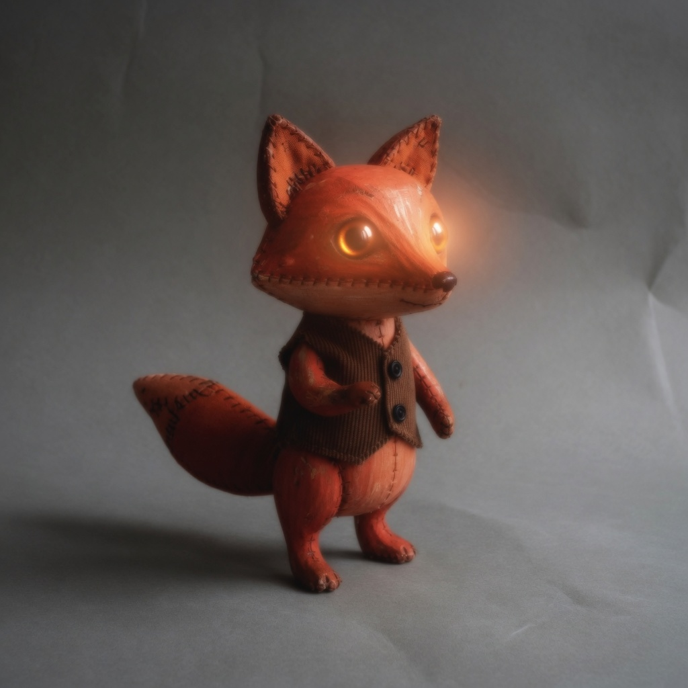

# observation obs_0051

## Metadata
- id: obs_0051
- source_type: generated
- study_id: [study_reconstruction_soft_halated_shadow_001](../studies/study_reconstruction_soft_halated_shadow_001.md)
- anchor_subject: anchor_character
- intended_vector: None
- intended_level: reconstruction
- seed: unavailable
- aspect_ratio: 1:1
- model: grok-imagine
- date: 2026-08-13

## Image


## Prompt
```
Use the attached source image as the locked subject. Preserve subject, pose, framing, and scene content. Do not describe a movie, decade, or named genre. Apply this image-formation change: heavy optical softness, melted fine detail, diffused highlight cores, lens-like bloom of definition. Apply this image-formation change: heavy inky shadow density, murky recesses, compressed shadow detail. Apply this image-formation change: mild halation, slight warm glow around lamps and speculars.
```

## Vector scores
| vector_id | score | confidence |
|---|---:|---:|
| [vec_optical_softness](../vectors/vec_optical_softness.md) | 0.58 | 0.64 |
| [vec_shadow_density](../vectors/vec_shadow_density.md) | 0.38 | 0.56 |
| [vec_halation](../vectors/vec_halation.md) | 0.78 | 0.72 |
| [vec_highlight_bloom](../vectors/vec_highlight_bloom.md) | 0.76 | 0.74 |
| [vec_edge_softness](../vectors/vec_edge_softness.md) | 0.64 | 0.60 |
| [vec_microcontrast](../vectors/vec_microcontrast.md) | 0.28 | 0.58 |
| [vec_diffusion](../vectors/vec_diffusion.md) | 0.40 | 0.50 |
| [vec_bokeh_softness](../vectors/vec_bokeh_softness.md) | 0.22 | 0.45 |
| [vec_black_level](../vectors/vec_black_level.md) | 0.40 | 0.50 |
| [vec_key_to_fill_ratio](../vectors/vec_key_to_fill_ratio.md) | 0.42 | 0.48 |
| [vec_source_hardness](../vectors/vec_source_hardness.md) | 0.30 | 0.40 |
| [vec_highlight_rolloff](../vectors/vec_highlight_rolloff.md) | 0.50 | 0.45 |

## Unintended changes
- eyes became lamps

## Notes
Linear reconstruction from optical softness, shadow density, and mild halation. Softness and glow landed. Eyes overfired. Shadow density stayed mild.
