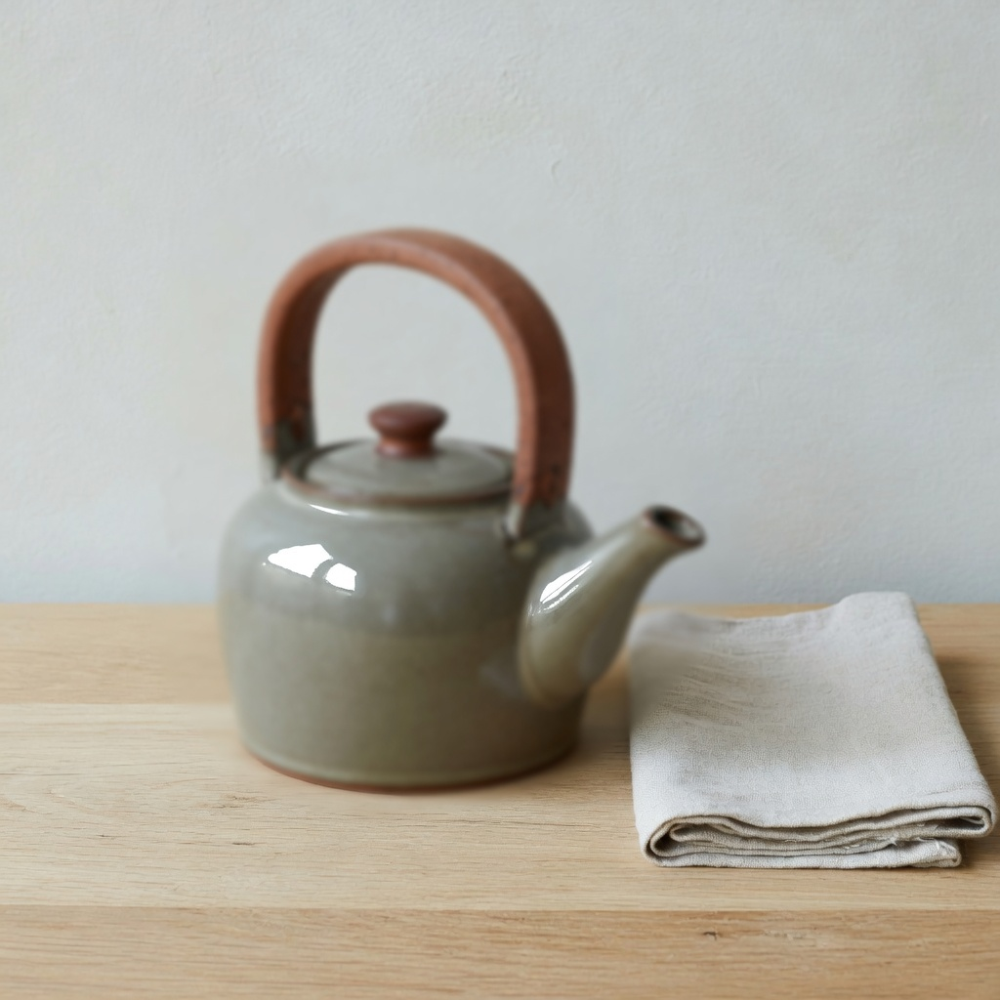

# observation obs_0061

## Metadata
- id: obs_0061
- source_type: generated
- study_id: [study_edge_softness_001](../studies/study_edge_softness_001.md)
- anchor_subject: anchor_object
- intended_vector: vec_edge_softness
- intended_level: high
- seed: unavailable
- aspect_ratio: 1:1
- model: grok-imagine
- date: 2026-08-13

## Image


## Prompt
```
Preserve the same subject, identity, pose, framing, crop, camera position, and key-light direction. Do not change wardrobe, props, or scene content. Do not restyle the picture into a period look, a movie still, or a genre.  Change only edge softness. Set edge softness to: heavy edge softness only: wide melted contours, dissolved outlines, highlight cores remain tight, no haze. Change only edge width. Do not add a diffusion veil, do not spread highlight cores, do not add circular bokeh orbs, do not glow the eyes, do not change lighting, do not change time of day, do not add grain, and do not restyle into a genre.
```

## Vector scores
| vector_id | score | confidence |
|---|---:|---:|
| [vec_optical_softness](../vectors/vec_optical_softness.md) | 0.78 | 0.74 |
| [vec_edge_softness](../vectors/vec_edge_softness.md) | 0.70 | 0.58 |
| [vec_diffusion](../vectors/vec_diffusion.md) | 0.08 | 0.55 |
| [vec_bokeh_softness](../vectors/vec_bokeh_softness.md) | 0.22 | 0.45 |
| [vec_microcontrast](../vectors/vec_microcontrast.md) | 0.35 | 0.50 |
| [vec_halation](../vectors/vec_halation.md) | 0.06 | 0.50 |
| [vec_highlight_bloom](../vectors/vec_highlight_bloom.md) | 0.08 | 0.50 |
| [vec_veiling_glare](../vectors/vec_veiling_glare.md) | 0.08 | 0.45 |
| [vec_shadow_density](../vectors/vec_shadow_density.md) | 0.28 | 0.40 |
| [vec_black_level](../vectors/vec_black_level.md) | 0.22 | 0.40 |
| [vec_key_to_fill_ratio](../vectors/vec_key_to_fill_ratio.md) | 0.28 | 0.35 |
| [vec_source_hardness](../vectors/vec_source_hardness.md) | 0.30 | 0.35 |
| [vec_highlight_rolloff](../vectors/vec_highlight_rolloff.md) | 0.35 | 0.35 |

## Unintended changes
- whole-subject defocus, not contour width only

## Notes
Intended edge softness high. Teapot high is optical melt. Isolation failed.
