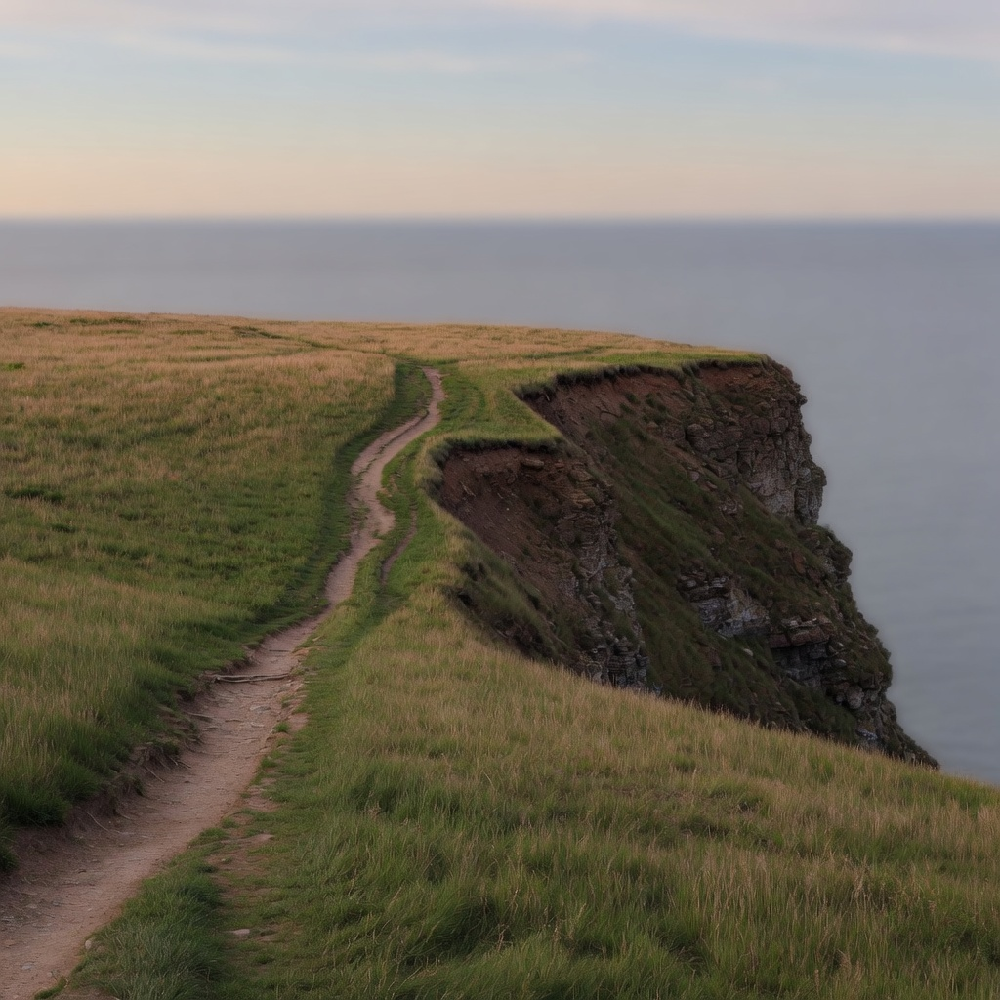

# observation obs_0096

## Metadata
- id: obs_0096
- source_type: generated
- study_id: [study_bokeh_softness_001](../studies/study_bokeh_softness_001.md)
- anchor_subject: anchor_landscape
- intended_vector: vec_bokeh_softness
- intended_level: medium
- seed: unavailable
- aspect_ratio: 1:1
- model: grok-imagine
- date: 2026-08-13

## Image


## Prompt
```
Preserve the same subject, identity, pose, framing, crop, camera position, and key-light direction. Do not change wardrobe, props, or scene content. Do not restyle the picture into a period look, a movie still, or a genre.  Change only bokeh softness. Set bokeh softness to: moderately creamy background dissolve, subject plane still sharp. Change only the out-of-focus field. Keep the subject plane sharp. Do not paint bokeh disks onto in-focus surfaces, do not melt the whole frame, do not glow the eyes, do not change lighting, do not change time of day, and do not restyle into a genre.
```

## Vector scores
| vector_id | score | confidence |
|---|---:|---:|
| [vec_optical_softness](../vectors/vec_optical_softness.md) | 0.16 | 0.55 |
| [vec_edge_softness](../vectors/vec_edge_softness.md) | 0.14 | 0.50 |
| [vec_diffusion](../vectors/vec_diffusion.md) | 0.08 | 0.55 |
| [vec_bokeh_softness](../vectors/vec_bokeh_softness.md) | 0.46 | 0.74 |
| [vec_microcontrast](../vectors/vec_microcontrast.md) | 0.60 | 0.50 |
| [vec_halation](../vectors/vec_halation.md) | 0.06 | 0.50 |
| [vec_highlight_bloom](../vectors/vec_highlight_bloom.md) | 0.08 | 0.50 |
| [vec_veiling_glare](../vectors/vec_veiling_glare.md) | 0.08 | 0.45 |
| [vec_shadow_density](../vectors/vec_shadow_density.md) | 0.28 | 0.40 |
| [vec_black_level](../vectors/vec_black_level.md) | 0.22 | 0.40 |
| [vec_key_to_fill_ratio](../vectors/vec_key_to_fill_ratio.md) | 0.28 | 0.35 |
| [vec_source_hardness](../vectors/vec_source_hardness.md) | 0.30 | 0.35 |
| [vec_highlight_rolloff](../vectors/vec_highlight_rolloff.md) | 0.35 | 0.35 |

## Unintended changes
- none recorded

## Notes
Intended bokeh softness medium.
