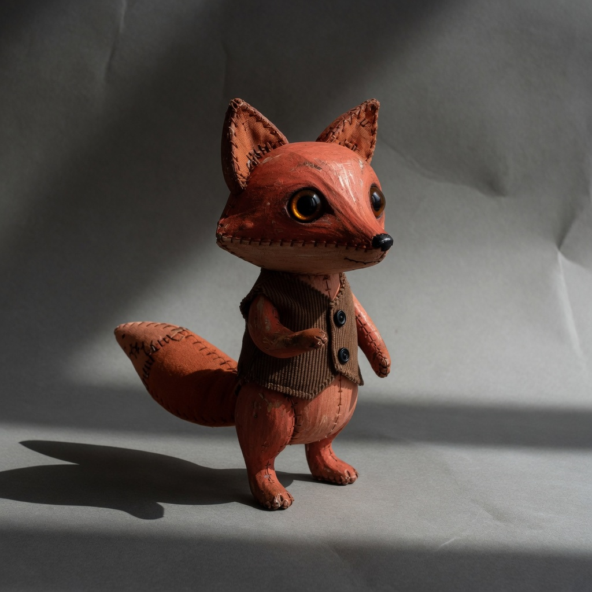

# observation obs_0114

## Metadata
- id: obs_0114
- source_type: generated
- study_id: [study_shadow_density_002](../studies/study_shadow_density_002.md)
- anchor_subject: anchor_character
- intended_vector: vec_shadow_density
- intended_level: medium
- seed: unavailable
- aspect_ratio: 1:1
- model: grok-imagine
- date: 2026-08-14

## Image


## Prompt
```
Preserve the same subject, identity, pose, framing, crop, camera position, and key-light direction. Do not change wardrobe, props, or scene content. Do not restyle the picture into a period look, a movie still, or a genre.  Change only shadow density. Set shadow density to: naturalistic shadow mass, same lighting as the source. Change only the mass of the darks as a grade. Do not move the key. Do not add or remove fill as a lamp. Do not harden the key into a new window. Do not invent a new cast-shadow edge. Do not lift or crush the black floor as fog. Do not add haze, grain, softness, hue, time of day, or a genre.
```

## Vector scores
| vector_id | score | confidence |
|---|---:|---:|
| [vec_shadow_density](../vectors/vec_shadow_density.md) | 0.42 | 0.76 |
| [vec_black_level](../vectors/vec_black_level.md) | 0.18 | 0.58 |
| [vec_key_to_fill_ratio](../vectors/vec_key_to_fill_ratio.md) | 0.39 | 0.60 |
| [vec_source_hardness](../vectors/vec_source_hardness.md) | 0.30 | 0.50 |
| [vec_global_contrast](../vectors/vec_global_contrast.md) | 0.40 | 0.45 |
| [vec_exposure_bias](../vectors/vec_exposure_bias.md) | 0.50 | 0.45 |
| [vec_veiling_glare](../vectors/vec_veiling_glare.md) | 0.08 | 0.45 |
| [vec_diffusion](../vectors/vec_diffusion.md) | 0.08 | 0.45 |
| [vec_optical_softness](../vectors/vec_optical_softness.md) | 0.18 | 0.45 |
| [vec_highlight_rolloff](../vectors/vec_highlight_rolloff.md) | 0.35 | 0.40 |

## Unintended changes
- none recorded

## Notes
Intended shadow density medium (clean sweep 002).
