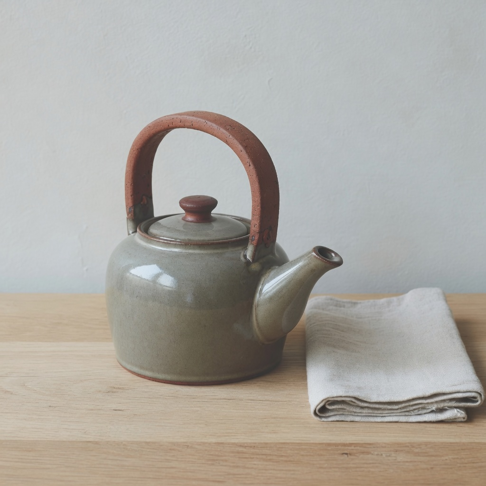

# observation obs_0121

## Metadata
- id: obs_0121
- source_type: generated
- study_id: [study_black_level_001](../studies/study_black_level_001.md)
- anchor_subject: anchor_object
- intended_vector: vec_black_level
- intended_level: high
- seed: unavailable
- aspect_ratio: 1:1
- model: grok-imagine
- date: 2026-08-14

## Image


## Prompt
```
Preserve the same subject, identity, pose, framing, crop, camera position, and key-light direction. Do not change wardrobe, props, or scene content. Do not restyle the picture into a period look, a movie still, or a genre.  Change only black level. Set black level to: lifted milky black floor, raised darkest values, no new fill light, no atmospheric haze. Change only the black floor. High means lifted milky blacks, not crushed blacks. Do not add fill light. Do not change key direction. Do not add haze or diffusion. Do not ink mid-shadows as a density sweep. Do not change sharpness, grain, hue, or time of day.
```

## Vector scores
| vector_id | score | confidence |
|---|---:|---:|
| [vec_shadow_density](../vectors/vec_shadow_density.md) | 0.17 | 0.58 |
| [vec_black_level](../vectors/vec_black_level.md) | 0.48 | 0.58 |
| [vec_key_to_fill_ratio](../vectors/vec_key_to_fill_ratio.md) | 0.28 | 0.55 |
| [vec_source_hardness](../vectors/vec_source_hardness.md) | 0.30 | 0.50 |
| [vec_global_contrast](../vectors/vec_global_contrast.md) | 0.40 | 0.45 |
| [vec_exposure_bias](../vectors/vec_exposure_bias.md) | 0.64 | 0.55 |
| [vec_veiling_glare](../vectors/vec_veiling_glare.md) | 0.08 | 0.45 |
| [vec_diffusion](../vectors/vec_diffusion.md) | 0.08 | 0.45 |
| [vec_optical_softness](../vectors/vec_optical_softness.md) | 0.18 | 0.45 |
| [vec_highlight_rolloff](../vectors/vec_highlight_rolloff.md) | 0.35 | 0.40 |

## Unintended changes
- none recorded

## Notes
Intended black level high. High is lift, not crush. Mild floor lift. Weak but correct polarity. No new shadows.
