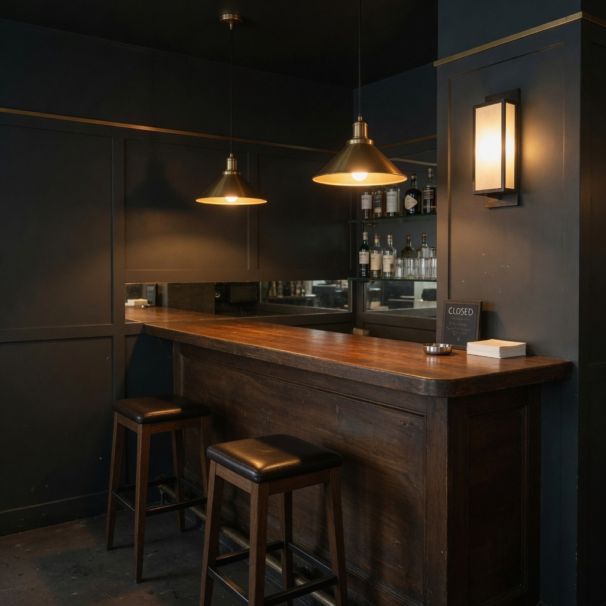

# observation obs_0150

## Metadata
- id: obs_0150
- source_type: generated
- study_id: [study_lamp_anchor_set_001](../studies/study_lamp_anchor_set_001.md)
- anchor_subject: anchor_lamp_architecture
- intended_vector: None
- intended_level: baseline
- seed: unavailable
- aspect_ratio: 1:1
- model: grok-imagine
- date: 2026-08-14

## Image


## Prompt
```
A small empty night bar interior: dark wood bar, two stools, no people. Two warm pendant lamps already on above the bar, and one wall sconce, all visible in frame. Those practicals light the room. No daylight. Clean contemporary architectural photograph: natural night color, moderate contrast, deep focus, no film effects, no extra glow, no grain. 24mm-equivalent, eye-level, square 1:1 frame.
```

## Vector scores
| vector_id | score | confidence |
|---|---:|---:|
| [vec_optical_softness](../vectors/vec_optical_softness.md) | 0.18 | 0.72 |
| [vec_edge_softness](../vectors/vec_edge_softness.md) | 0.16 | 0.68 |
| [vec_microcontrast](../vectors/vec_microcontrast.md) | 0.64 | 0.70 |
| [vec_diffusion](../vectors/vec_diffusion.md) | 0.08 | 0.60 |
| [vec_halation](../vectors/vec_halation.md) | 0.04 | 0.70 |
| [vec_highlight_bloom](../vectors/vec_highlight_bloom.md) | 0.06 | 0.66 |
| [vec_bokeh_softness](../vectors/vec_bokeh_softness.md) | 0.10 | 0.55 |
| [vec_shadow_density](../vectors/vec_shadow_density.md) | 0.30 | 0.68 |
| [vec_black_level](../vectors/vec_black_level.md) | 0.22 | 0.60 |
| [vec_key_to_fill_ratio](../vectors/vec_key_to_fill_ratio.md) | 0.28 | 0.58 |
| [vec_source_hardness](../vectors/vec_source_hardness.md) | 0.32 | 0.55 |
| [vec_highlight_rolloff](../vectors/vec_highlight_rolloff.md) | 0.35 | 0.50 |

## Unintended changes
- none recorded

## Notes
Lamp-present lock. Visible practical confirmed. Baseline scores for the locked anchor.
