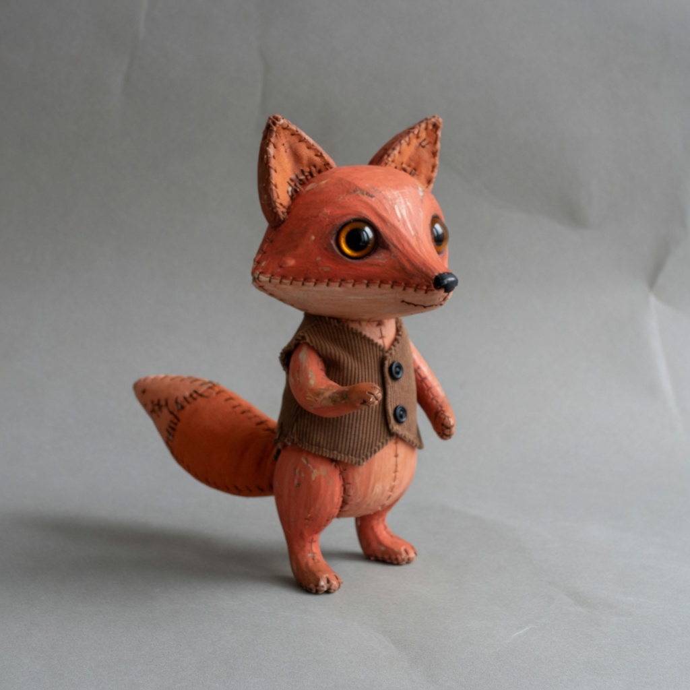

# observation obs_0182

## Metadata
- id: obs_0182
- source_type: generated
- study_id: [study_telecine_softness_001](../studies/study_telecine_softness_001.md)
- anchor_subject: anchor_character
- intended_vector: vec_telecine_softness
- intended_level: high
- seed: unavailable
- aspect_ratio: 1:1
- model: grok-imagine
- date: 2026-08-14

## Image


## Prompt
```
Preserve the same subject, identity, pose, framing, crop, camera position, and key-light direction. Do not change wardrobe, props, or scene content. Do not restyle the picture into a period look, a movie still, or a genre.  Change only telecine softness. Set telecine softness to: heavy telecine transfer smear, flat electronic softness, fine detail lost to bandwidth, mild chroma smear across edges, still a photograph. Change only transfer-path smear. Do not add scanlines, tracking bars, a CRT bezel, or a television set. Do not add film grain. Do not melt like a portrait lens. Do not add a diffusion veil. Do not change lighting, time of day, hue, or restyle into a decade or genre.
```

## Vector scores
| vector_id | score | confidence |
|---|---:|---:|
| [vec_telecine_softness](../vectors/vec_telecine_softness.md) | 0.56 | 0.62 |
| [vec_analog_video_texture](../vectors/vec_analog_video_texture.md) | 0.16 | 0.55 |
| [vec_optical_softness](../vectors/vec_optical_softness.md) | 0.28 | 0.58 |
| [vec_vhs_bandwidth_loss](../vectors/vec_vhs_bandwidth_loss.md) | 0.08 | 0.50 |
| [vec_fine_detail_rolloff](../vectors/vec_fine_detail_rolloff.md) | 0.42 | 0.50 |
| [vec_grain_structure](../vectors/vec_grain_structure.md) | 0.08 | 0.45 |
| [vec_diffusion](../vectors/vec_diffusion.md) | 0.08 | 0.40 |
| [vec_edge_softness](../vectors/vec_edge_softness.md) | 0.16 | 0.40 |
| [vec_microcontrast](../vectors/vec_microcontrast.md) | 0.60 | 0.40 |
| [vec_halation](../vectors/vec_halation.md) | 0.06 | 0.35 |
| [vec_highlight_bloom](../vectors/vec_highlight_bloom.md) | 0.08 | 0.35 |

## Unintended changes
- none recorded

## Notes
Intended telecine softness high. Stitches survive. Eyes stay glass. Mild smear only.
