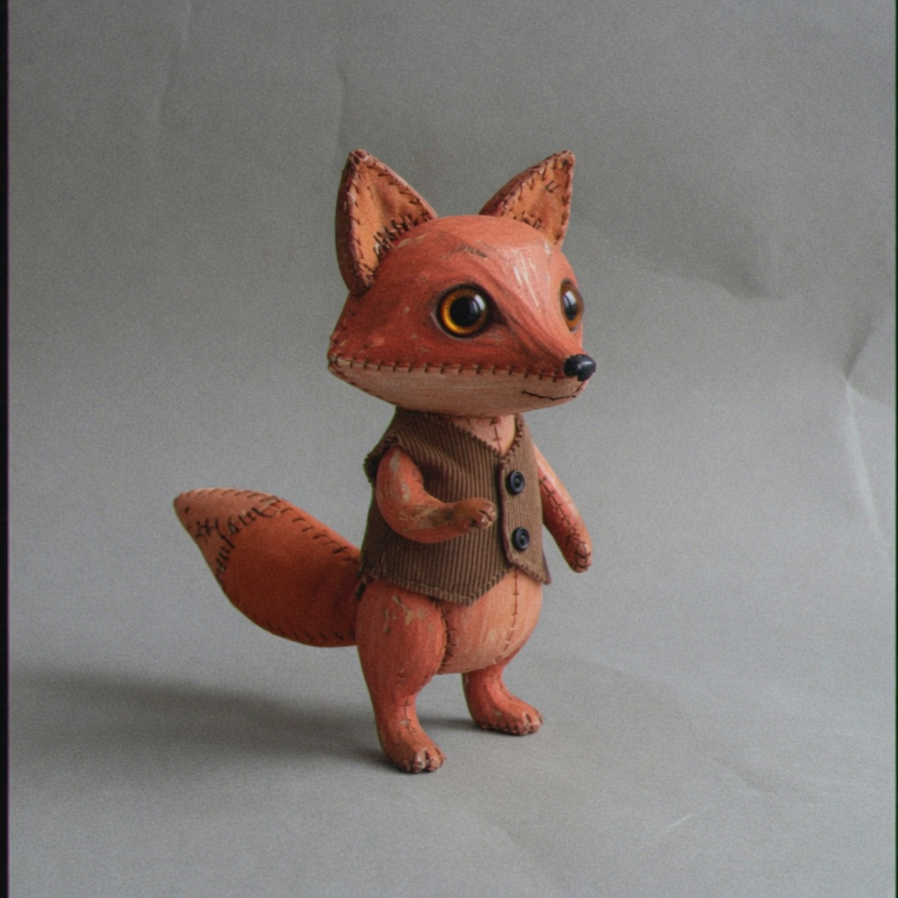

# observation obs_0187

## Metadata
- id: obs_0187
- source_type: generated
- study_id: [study_analog_video_texture_001](../studies/study_analog_video_texture_001.md)
- anchor_subject: anchor_character
- intended_vector: vec_analog_video_texture
- intended_level: high
- seed: unavailable
- aspect_ratio: 1:1
- model: grok-imagine
- date: 2026-08-14

## Image


## Prompt
```
Preserve the same subject, identity, pose, framing, crop, camera position, and key-light direction. Do not change wardrobe, props, or scene content. Do not restyle the picture into a period look, a movie still, or a genre.  Change only analog video texture. Set analog video texture to: heavy analog video texture, visible scan-like luma grain, chroma crawl, mild banding, keep subject edges, no extra lens melt. Change only analog video texture. Do not add extra optical softness or diffusion. Do not add a CRT bezel, letterbox, or tracking-error bars. Do not change lighting, time of day, or restyle into a decade or genre. Do not add photochemical grain clumps.
```

## Vector scores
| vector_id | score | confidence |
|---|---:|---:|
| [vec_telecine_softness](../vectors/vec_telecine_softness.md) | 0.23 | 0.55 |
| [vec_analog_video_texture](../vectors/vec_analog_video_texture.md) | 0.76 | 0.72 |
| [vec_optical_softness](../vectors/vec_optical_softness.md) | 0.16 | 0.58 |
| [vec_vhs_bandwidth_loss](../vectors/vec_vhs_bandwidth_loss.md) | 0.08 | 0.50 |
| [vec_fine_detail_rolloff](../vectors/vec_fine_detail_rolloff.md) | 0.20 | 0.45 |
| [vec_grain_structure](../vectors/vec_grain_structure.md) | 0.28 | 0.50 |
| [vec_diffusion](../vectors/vec_diffusion.md) | 0.08 | 0.40 |
| [vec_edge_softness](../vectors/vec_edge_softness.md) | 0.16 | 0.40 |
| [vec_microcontrast](../vectors/vec_microcontrast.md) | 0.60 | 0.40 |
| [vec_halation](../vectors/vec_halation.md) | 0.06 | 0.35 |
| [vec_highlight_bloom](../vectors/vec_highlight_bloom.md) | 0.08 | 0.35 |

## Unintended changes
- letterbox bars

## Notes
Intended analog video texture high. Texture lands. Added black side bars. Eyes stay glass.
