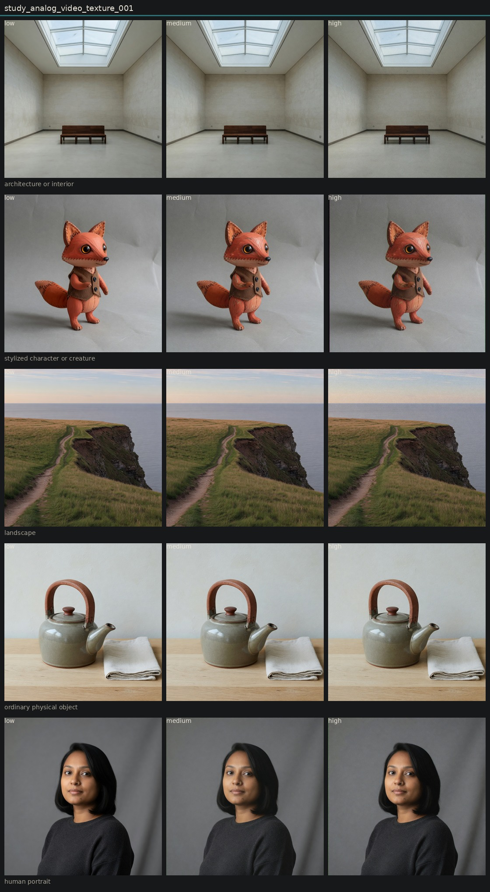

# Controlled variation of analog video texture

## Metadata
- id: study_analog_video_texture_001
- candidate: [vec_analog_video_texture](../vectors/vec_analog_video_texture.md)
- status: complete
- date: 2026-08-14
- decision: provisional

## Protocol
Hold subject via locked anchor images. image_edit each anchor to low, medium, and high of one candidate. Do not change other dimensions on purpose.

## Hold constant
- subject identity
- pose and blocking
- framing and crop
- camera height and distance
- key light direction
- scene content
- source image when editing

## Comparison grid

## Observations
- [obs_0186](../observations/obs_0186.md) anchor_architecture high
- [obs_0187](../observations/obs_0187.md) anchor_character high
- [obs_0188](../observations/obs_0188.md) anchor_landscape high
- [obs_0189](../observations/obs_0189.md) anchor_object high
- [obs_0190](../observations/obs_0190.md) anchor_portrait high
- [obs_0196](../observations/obs_0196.md) anchor_architecture medium
- [obs_0197](../observations/obs_0197.md) anchor_character medium
- [obs_0198](../observations/obs_0198.md) anchor_landscape medium
- [obs_0199](../observations/obs_0199.md) anchor_object medium
- [obs_0200](../observations/obs_0200.md) anchor_portrait medium
- [obs_0206](../observations/obs_0206.md) anchor_architecture low
- [obs_0207](../observations/obs_0207.md) anchor_character low
- [obs_0208](../observations/obs_0208.md) anchor_landscape low
- [obs_0209](../observations/obs_0209.md) anchor_object low
- [obs_0210](../observations/obs_0210.md) anchor_portrait low

## Decision
High lays a scan-like grain field while subject edges stay. Portrait and gallery isolate it. Fox high added letterbox bars. Not a lens melt and not a bare telecine smear.

## Entanglement
- Character high invented letterbox bars.
- Landscape high warmed the grade a little.

## Next experiments
- VHS bandwidth loss versus this texture if a tape-only look is needed.

## Notes
