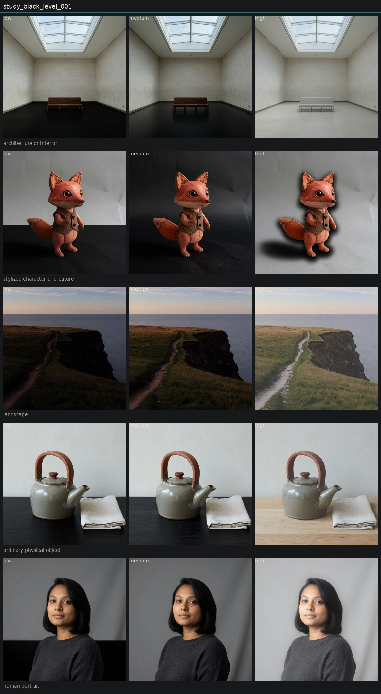

# Controlled variation of black level

## Metadata
- id: study_black_level_001
- candidate: [vec_black_level](../vectors/vec_black_level.md)
- status: complete
- date: 2026-08-14
- decision: provisional

## Protocol
Hold subject via locked anchor images. image_edit each anchor to low, medium, and high of one candidate. Do not change other dimensions on purpose.

## Hold constant
- subject identity
- pose and blocking
- framing and crop
- camera height and distance
- key light direction
- scene content
- source image when editing

## Comparison grid

## Observations
- [obs_0116](../observations/obs_0116.md) anchor_portrait low
- [obs_0117](../observations/obs_0117.md) anchor_portrait medium
- [obs_0118](../observations/obs_0118.md) anchor_portrait high
- [obs_0119](../observations/obs_0119.md) anchor_object low
- [obs_0120](../observations/obs_0120.md) anchor_object medium
- [obs_0121](../observations/obs_0121.md) anchor_object high
- [obs_0122](../observations/obs_0122.md) anchor_architecture low
- [obs_0123](../observations/obs_0123.md) anchor_architecture medium
- [obs_0124](../observations/obs_0124.md) anchor_architecture high
- [obs_0125](../observations/obs_0125.md) anchor_landscape low
- [obs_0126](../observations/obs_0126.md) anchor_landscape medium
- [obs_0127](../observations/obs_0127.md) anchor_landscape high
- [obs_0128](../observations/obs_0128.md) anchor_character low
- [obs_0129](../observations/obs_0129.md) anchor_character medium
- [obs_0130](../observations/obs_0130.md) anchor_character high

## Decision
High is lift, not crush. Portrait backdrop and sweater floor rise while the face stays. That is the opposite direction of density high. Object high is weak but the polarity is correct. No new cast shadows.

## Entanglement
- Some global exposure lift rides along.
- Still-life high is a small step.

## Next experiments
- Black level vs veiling glare on the gallery only.

## Notes
