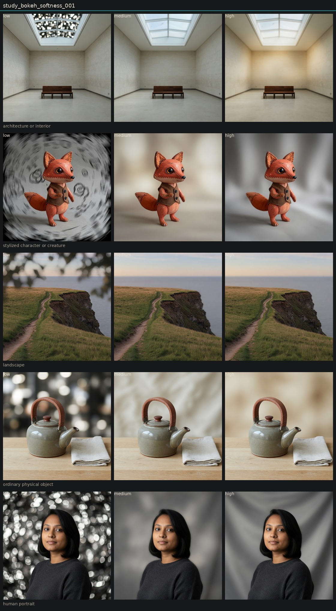

# Controlled variation of bokeh softness

## Metadata
- id: study_bokeh_softness_001
- candidate: [vec_bokeh_softness](../vectors/vec_bokeh_softness.md)
- status: complete
- date: 2026-08-13
- decision: provisional

## Protocol
Hold subject via locked anchor images. image_edit each anchor to low, medium, and high of one candidate. Do not change other dimensions on purpose.

## Hold constant
- subject identity
- pose and blocking
- framing and crop
- camera height and distance
- key light direction
- scene content
- source image when editing

## Comparison grid

## Observations
- [obs_0086](../observations/obs_0086.md) anchor_portrait low
- [obs_0087](../observations/obs_0087.md) anchor_portrait medium
- [obs_0088](../observations/obs_0088.md) anchor_portrait high
- [obs_0089](../observations/obs_0089.md) anchor_object low
- [obs_0090](../observations/obs_0090.md) anchor_object medium
- [obs_0091](../observations/obs_0091.md) anchor_object high
- [obs_0092](../observations/obs_0092.md) anchor_architecture low
- [obs_0093](../observations/obs_0093.md) anchor_architecture medium
- [obs_0094](../observations/obs_0094.md) anchor_architecture high
- [obs_0095](../observations/obs_0095.md) anchor_landscape low
- [obs_0096](../observations/obs_0096.md) anchor_landscape medium
- [obs_0097](../observations/obs_0097.md) anchor_landscape high
- [obs_0098](../observations/obs_0098.md) anchor_character low
- [obs_0099](../observations/obs_0099.md) anchor_character medium
- [obs_0100](../observations/obs_0100.md) anchor_character high

## Decision
When a subject plane exists, the field creams and the subject stays sharp: teapot, fox, portrait. The deep-focus gallery has no plane, so the whole room defocuses. Distinct, conditional on geometry.

## Entanglement
- Portrait and fox gained invented backdrop folds so the field could dissolve.
- Architecture high is optical softness, not bokeh.

## Next experiments
- Bokeh study only on frames that already have a clear subject/field split.

## Notes
