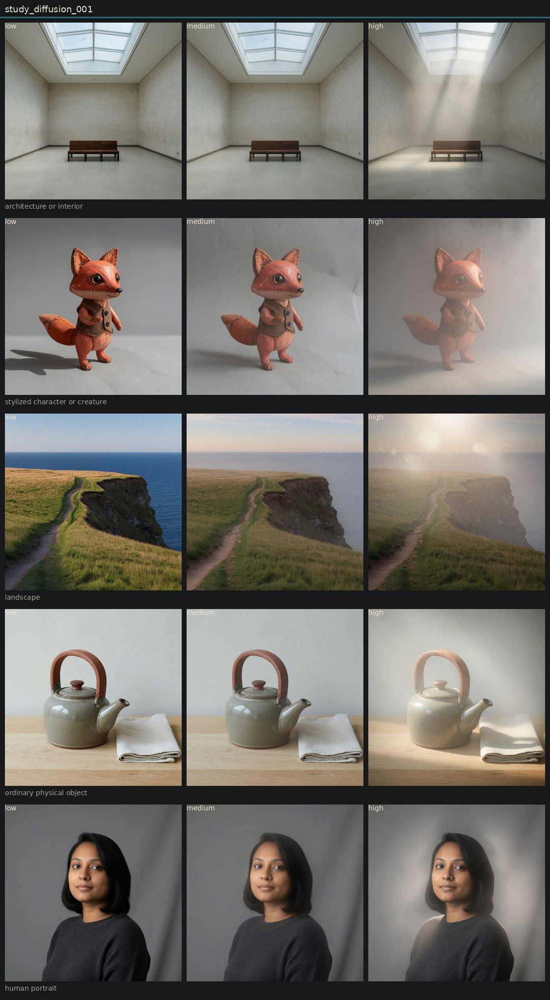

# Controlled variation of diffusion

## Metadata
- id: study_diffusion_001
- candidate: [vec_diffusion](../vectors/vec_diffusion.md)
- status: complete
- date: 2026-08-13
- decision: provisional

## Protocol
Hold subject via locked anchor images. image_edit each anchor to low, medium, and high of one candidate. Do not change other dimensions on purpose.

## Hold constant
- subject identity
- pose and blocking
- framing and crop
- camera height and distance
- key light direction
- scene content
- source image when editing

## Comparison grid

## Observations
- [obs_0071](../observations/obs_0071.md) anchor_portrait low
- [obs_0072](../observations/obs_0072.md) anchor_portrait medium
- [obs_0073](../observations/obs_0073.md) anchor_portrait high
- [obs_0074](../observations/obs_0074.md) anchor_object low
- [obs_0075](../observations/obs_0075.md) anchor_object medium
- [obs_0076](../observations/obs_0076.md) anchor_object high
- [obs_0077](../observations/obs_0077.md) anchor_architecture low
- [obs_0078](../observations/obs_0078.md) anchor_architecture medium
- [obs_0079](../observations/obs_0079.md) anchor_architecture high
- [obs_0080](../observations/obs_0080.md) anchor_landscape low
- [obs_0081](../observations/obs_0081.md) anchor_landscape medium
- [obs_0082](../observations/obs_0082.md) anchor_landscape high
- [obs_0083](../observations/obs_0083.md) anchor_character low
- [obs_0084](../observations/obs_0084.md) anchor_character medium
- [obs_0085](../observations/obs_0085.md) anchor_character high

## Decision
High diffusion adds a scattering veil while edges stay closer to the source than in optical-softness highs. Architecture and portrait isolate it best. Landscape invents a sun. Distinct enough to stay in the basis as provisional.

## Entanglement
- Often co-produces atmospheric haze and god rays.
- Landscape high adds flare orbs and a time-of-day shift.

## Next experiments
- Diffusion vs veiling glare vs atmospheric haze on the gallery and portrait only.

## Notes
