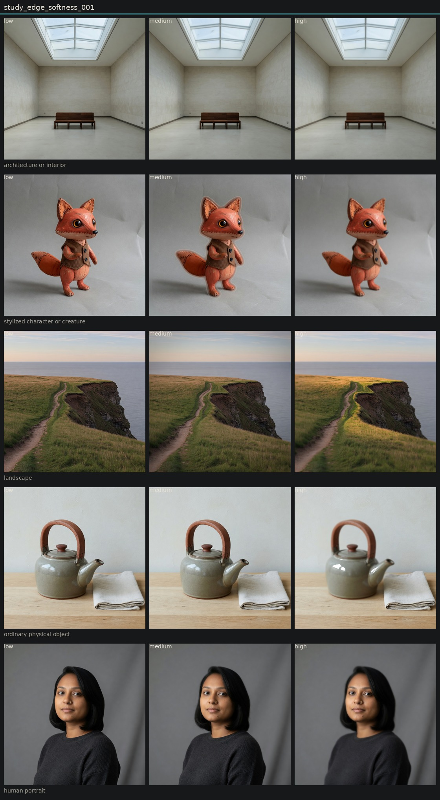

# Controlled variation of edge softness

## Metadata
- id: study_edge_softness_001
- candidate: [vec_edge_softness](../vectors/vec_edge_softness.md)
- status: complete
- date: 2026-08-13
- decision: near_alias

## Protocol
Hold subject via locked anchor images. image_edit each anchor to low, medium, and high of one candidate. Do not change other dimensions on purpose.

## Hold constant
- subject identity
- pose and blocking
- framing and crop
- camera height and distance
- key light direction
- scene content
- source image when editing

## Comparison grid

## Observations
- [obs_0056](../observations/obs_0056.md) anchor_portrait low
- [obs_0057](../observations/obs_0057.md) anchor_portrait medium
- [obs_0058](../observations/obs_0058.md) anchor_portrait high
- [obs_0059](../observations/obs_0059.md) anchor_object low
- [obs_0060](../observations/obs_0060.md) anchor_object medium
- [obs_0061](../observations/obs_0061.md) anchor_object high
- [obs_0062](../observations/obs_0062.md) anchor_architecture low
- [obs_0063](../observations/obs_0063.md) anchor_architecture medium
- [obs_0064](../observations/obs_0064.md) anchor_architecture high
- [obs_0065](../observations/obs_0065.md) anchor_landscape low
- [obs_0066](../observations/obs_0066.md) anchor_landscape medium
- [obs_0067](../observations/obs_0067.md) anchor_landscape high
- [obs_0068](../observations/obs_0068.md) anchor_character low
- [obs_0069](../observations/obs_0069.md) anchor_character medium
- [obs_0070](../observations/obs_0070.md) anchor_character high

## Decision
High edge softness usually melts the whole subject, especially the teapot. That is optical softness, not contour width. The fox is the only mild edge-only result. Treat as a near-alias or child of optical softness on this instrument.

## Entanglement
- Object high is global defocus.
- Portrait high melts hair and face together.
- No circular orbs and no glowing eyes. The hold against those leaks worked.

## Next experiments
- If kept, test a weaker high phrase: thicken outlines only, keep pores and glaze texture.

## Notes
