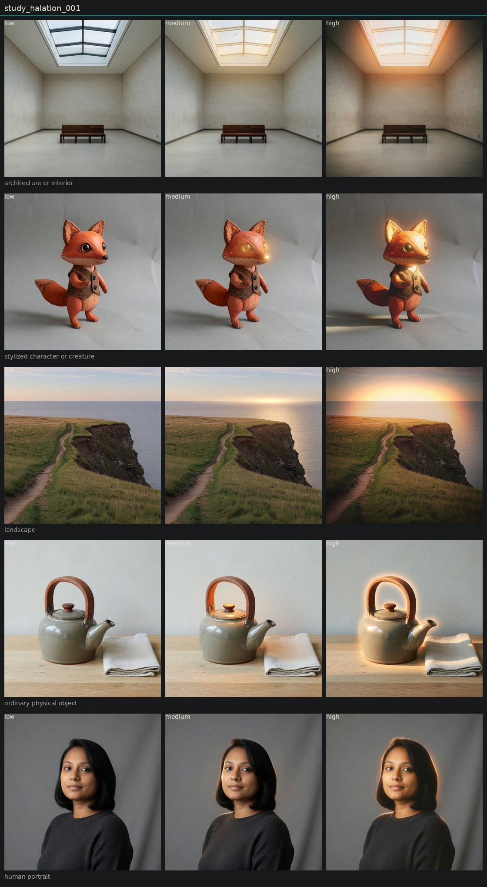

# Controlled variation of halation

## Metadata
- id: study_halation_001
- candidate: [vec_halation](../vectors/vec_halation.md)
- status: complete
- date: 2026-08-13
- decision: provisional

## Protocol
Hold subject via locked anchor images. image_edit each anchor to low, medium, and high of one candidate. Do not change other dimensions on purpose.

## Hold constant
- subject identity
- pose and blocking
- framing and crop
- camera height and distance
- key light direction
- scene content
- source image when editing

## Comparison grid

## Observations
- [obs_0036](../observations/obs_0036.md) anchor_portrait low
- [obs_0037](../observations/obs_0037.md) anchor_portrait medium
- [obs_0038](../observations/obs_0038.md) anchor_portrait high
- [obs_0039](../observations/obs_0039.md) anchor_object low
- [obs_0040](../observations/obs_0040.md) anchor_object medium
- [obs_0041](../observations/obs_0041.md) anchor_object high
- [obs_0042](../observations/obs_0042.md) anchor_architecture low
- [obs_0043](../observations/obs_0043.md) anchor_architecture medium
- [obs_0044](../observations/obs_0044.md) anchor_architecture high
- [obs_0045](../observations/obs_0045.md) anchor_landscape low
- [obs_0046](../observations/obs_0046.md) anchor_landscape medium
- [obs_0047](../observations/obs_0047.md) anchor_landscape high
- [obs_0048](../observations/obs_0048.md) anchor_character low
- [obs_0049](../observations/obs_0049.md) anchor_character medium
- [obs_0050](../observations/obs_0050.md) anchor_character high

## Decision
A glow appears at the high pole, but it is rarely film-base bleed around existing highlights. Imagine invents rim lights, sunsets, or silhouette auras. Architecture around the skylight is the best local-bleed example. Keep provisional.

## Entanglement
- Halation and highlight bloom are not separated by the current prompts.
- Scenes without strong practicals grow new lights instead of bleeding old ones.
- Landscape high changed time of day.

## Next experiments
- See study_halation_002 for the lamp-present sweep.

## Notes
