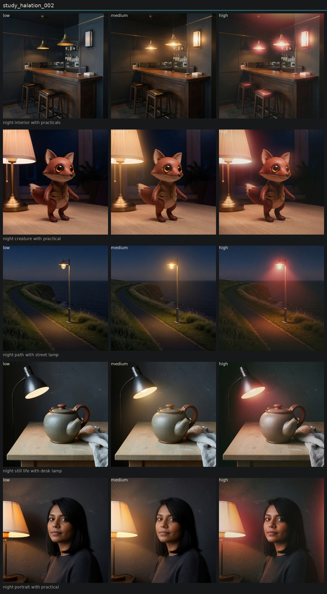

# Controlled variation of halation

## Metadata
- id: study_halation_002
- candidate: [vec_halation](../vectors/vec_halation.md)
- status: complete
- date: 2026-08-14
- decision: provisional

## Protocol
Hold subject via locked anchor images. image_edit each anchor to low, medium, and high of one candidate. Do not change other dimensions on purpose.

## Hold constant
- subject identity
- pose and blocking
- framing and crop
- camera height and distance
- key light direction
- scene content
- source image when editing

## Comparison grid

## Observations
- [obs_0151](../observations/obs_0151.md) anchor_lamp_portrait low
- [obs_0152](../observations/obs_0152.md) anchor_lamp_portrait medium
- [obs_0153](../observations/obs_0153.md) anchor_lamp_portrait high
- [obs_0154](../observations/obs_0154.md) anchor_lamp_object low
- [obs_0155](../observations/obs_0155.md) anchor_lamp_object medium
- [obs_0156](../observations/obs_0156.md) anchor_lamp_object high
- [obs_0157](../observations/obs_0157.md) anchor_lamp_architecture low
- [obs_0158](../observations/obs_0158.md) anchor_lamp_architecture medium
- [obs_0159](../observations/obs_0159.md) anchor_lamp_architecture high
- [obs_0160](../observations/obs_0160.md) anchor_lamp_landscape low
- [obs_0161](../observations/obs_0161.md) anchor_lamp_landscape medium
- [obs_0162](../observations/obs_0162.md) anchor_lamp_landscape high
- [obs_0163](../observations/obs_0163.md) anchor_lamp_character low
- [obs_0164](../observations/obs_0164.md) anchor_lamp_character medium
- [obs_0165](../observations/obs_0165.md) anchor_lamp_character high

## Decision
With lamps already in frame, high produces a warm or reddish leak from those lamps. Portrait and landscape do not invent a hair-rim or a sunset. Distinct from highlight bloom.

## Entanglement
- Some frames still add a secondary red wash at the far edge.
- Bloom still rises a little when halation rises.

## Next experiments
- Optical versus telecine on the original daylight anchors.

## Notes
