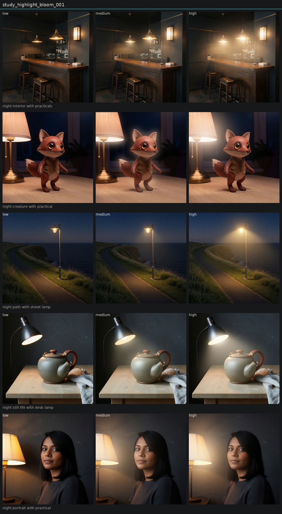

# Controlled variation of highlight bloom

## Metadata
- id: study_highlight_bloom_001
- candidate: [vec_highlight_bloom](../vectors/vec_highlight_bloom.md)
- status: complete
- date: 2026-08-14
- decision: provisional

## Protocol
Hold subject via locked anchor images. image_edit each anchor to low, medium, and high of one candidate. Do not change other dimensions on purpose.

## Hold constant
- subject identity
- pose and blocking
- framing and crop
- camera height and distance
- key light direction
- scene content
- source image when editing

## Comparison grid

## Observations
- [obs_0166](../observations/obs_0166.md) anchor_lamp_portrait low
- [obs_0167](../observations/obs_0167.md) anchor_lamp_portrait medium
- [obs_0168](../observations/obs_0168.md) anchor_lamp_portrait high
- [obs_0169](../observations/obs_0169.md) anchor_lamp_object low
- [obs_0170](../observations/obs_0170.md) anchor_lamp_object medium
- [obs_0171](../observations/obs_0171.md) anchor_lamp_object high
- [obs_0172](../observations/obs_0172.md) anchor_lamp_architecture low
- [obs_0173](../observations/obs_0173.md) anchor_lamp_architecture medium
- [obs_0174](../observations/obs_0174.md) anchor_lamp_architecture high
- [obs_0175](../observations/obs_0175.md) anchor_lamp_landscape low
- [obs_0176](../observations/obs_0176.md) anchor_lamp_landscape medium
- [obs_0177](../observations/obs_0177.md) anchor_lamp_landscape high
- [obs_0178](../observations/obs_0178.md) anchor_lamp_character low
- [obs_0179](../observations/obs_0179.md) anchor_lamp_character medium
- [obs_0180](../observations/obs_0180.md) anchor_lamp_character high

## Decision
High is a pale, broader glow around existing bright regions. Not a red lamp-lip. Same practicals. Distinct from honest halation on portrait, landscape, and bar.

## Entanglement
- Bar bloom can read as atmospheric haze between pendants.

## Next experiments
- Bloom versus final bloom versus veiling glare if a finishing layer is needed.

## Notes
