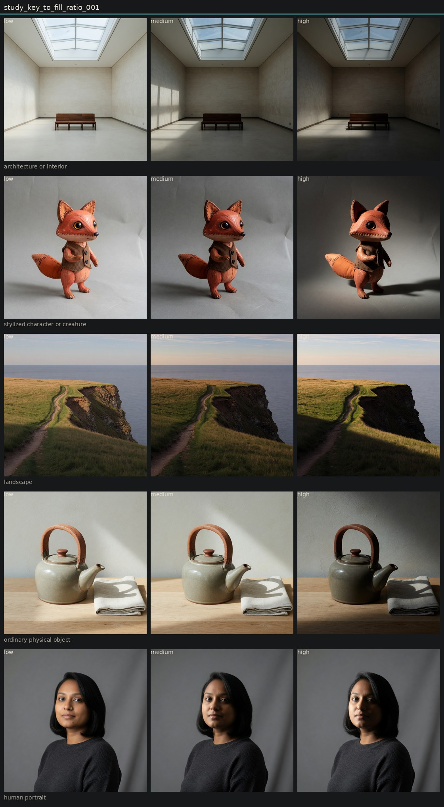

# Controlled variation of key-to-fill ratio

## Metadata
- id: study_key_to_fill_ratio_001
- candidate: [vec_key_to_fill_ratio](../vectors/vec_key_to_fill_ratio.md)
- status: complete
- date: 2026-08-14
- decision: provisional

## Protocol
Hold subject via locked anchor images. image_edit each anchor to low, medium, and high of one candidate. Do not change other dimensions on purpose.

## Hold constant
- subject identity
- pose and blocking
- framing and crop
- camera height and distance
- key light direction
- scene content
- source image when editing

## Comparison grid

## Observations
- [obs_0131](../observations/obs_0131.md) anchor_portrait low
- [obs_0132](../observations/obs_0132.md) anchor_portrait medium
- [obs_0133](../observations/obs_0133.md) anchor_portrait high
- [obs_0134](../observations/obs_0134.md) anchor_object low
- [obs_0135](../observations/obs_0135.md) anchor_object medium
- [obs_0136](../observations/obs_0136.md) anchor_object high
- [obs_0137](../observations/obs_0137.md) anchor_architecture low
- [obs_0138](../observations/obs_0138.md) anchor_architecture medium
- [obs_0139](../observations/obs_0139.md) anchor_architecture high
- [obs_0140](../observations/obs_0140.md) anchor_landscape low
- [obs_0141](../observations/obs_0141.md) anchor_landscape medium
- [obs_0142](../observations/obs_0142.md) anchor_landscape high
- [obs_0143](../observations/obs_0143.md) anchor_character low
- [obs_0144](../observations/obs_0144.md) anchor_character medium
- [obs_0145](../observations/obs_0145.md) anchor_character high

## Decision
Portrait high sculpts the face: fill dies, knit stays readable. That is lighting ratio, not ink. Teapot high restages a hard window and a handle shadow. Ratio is real. Hardness still leaks.

## Entanglement
- Object high is also source hardness.
- Landscape is a weak ratio read.

## Next experiments
- Key-to-fill vs source hardness on the teapot only, with an explicit hold against new window edges.

## Notes
