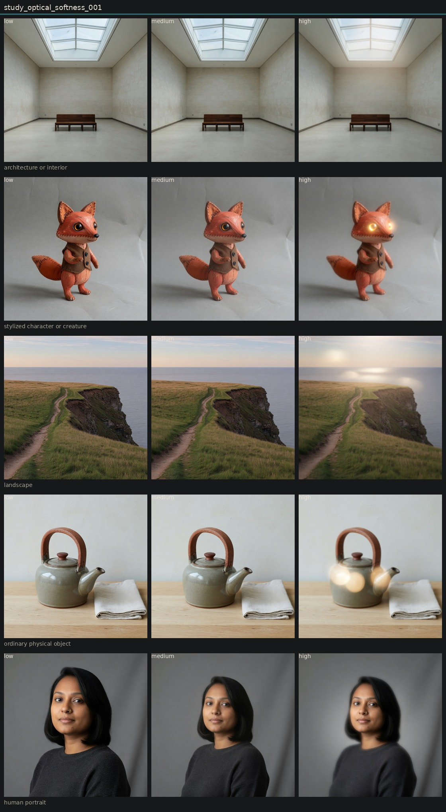

# Controlled variation of optical softness

## Metadata
- id: study_optical_softness_001
- candidate: [vec_optical_softness](../vectors/vec_optical_softness.md)
- status: complete
- date: 2026-08-13
- decision: provisional

## Protocol
Hold subject via locked anchor images. image_edit each anchor to low, medium, and high of one candidate. Do not change other dimensions on purpose.

## Hold constant
- subject identity
- pose and blocking
- framing and crop
- camera height and distance
- key light direction
- scene content
- source image when editing

## Comparison grid

## Observations
- [obs_0006](../observations/obs_0006.md) anchor_architecture medium
- [obs_0007](../observations/obs_0007.md) anchor_object low
- [obs_0008](../observations/obs_0008.md) anchor_object medium
- [obs_0009](../observations/obs_0009.md) anchor_object high
- [obs_0010](../observations/obs_0010.md) anchor_portrait low
- [obs_0011](../observations/obs_0011.md) anchor_portrait medium
- [obs_0012](../observations/obs_0012.md) anchor_architecture low
- [obs_0013](../observations/obs_0013.md) anchor_architecture high
- [obs_0014](../observations/obs_0014.md) anchor_portrait high
- [obs_0015](../observations/obs_0015.md) anchor_character low
- [obs_0016](../observations/obs_0016.md) anchor_character medium
- [obs_0017](../observations/obs_0017.md) anchor_character high
- [obs_0018](../observations/obs_0018.md) anchor_landscape low
- [obs_0019](../observations/obs_0019.md) anchor_landscape medium
- [obs_0020](../observations/obs_0020.md) anchor_landscape high

## Decision
Low versus high is visible on all five anchors. The change is transferable. It is not cleanly isolated: high settings often add bloom, fake bokeh, glowing speculars, or a tilt-shift focus pattern. Medium is a weak step. Keep as provisional, not canonical.

## Entanglement
- High optical softness co-produces highlight bloom and, on the teapot, circular orbs.
- Character high turns glass eyes into lamps (halation leak).
- Landscape high behaves like shallow DOF more than like a uniform optical melt.
- Microcontrast falls whenever softness rises. Inverse test still needed.

## Next experiments
- Discrimination study: optical softness vs edge softness vs diffusion vs bokeh softness.
- Retry high softness with an explicit ban on bokeh discs and glowing eyes.
- Add a mid-high step (0.65) because medium is too close to the anchor.

## Notes
