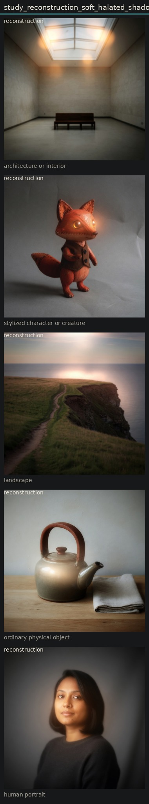

# Linear reconstruction of aes_soft_halated_shadow

## Metadata
- id: study_reconstruction_soft_halated_shadow_001
- candidate: [vec_optical_softness](../vectors/vec_optical_softness.md)
- status: complete
- date: 2026-08-13
- decision: linear_partial

## Protocol
Translate aesthetic weights into prompt phrases and edit each anchor.

## Hold constant
- subject identity
- pose and blocking
- framing and crop
- camera height and distance
- key light direction
- scene content
- source image when editing

## Comparison grid

## Observations
- [obs_0051](../observations/obs_0051.md) anchor_character reconstruction
- [obs_0052](../observations/obs_0052.md) anchor_object reconstruction
- [obs_0053](../observations/obs_0053.md) anchor_portrait reconstruction
- [obs_0054](../observations/obs_0054.md) anchor_architecture reconstruction
- [obs_0055](../observations/obs_0055.md) anchor_landscape reconstruction

## Decision
The weighted prompt moved all five anchors toward softness plus some darkening plus glow. Linear combination is a usable first-order control. Residual bloom and invented eye/sun lights show the linear model is incomplete, but not yet enough to require a tensor term. Record pairwise notes and keep the model linear.

## Entanglement
- Softness and bloom still co-occur in the reconstruction.
- Shadow density under-expresses relative to its isolated high pole.

## Next experiments
- Raise only shadow density after a soft reconstruction (sequential, not simultaneous).
- Fit weights by comparing reconstruction scores to isolated high poles.

## Notes
target=aes_soft_halated_shadow
