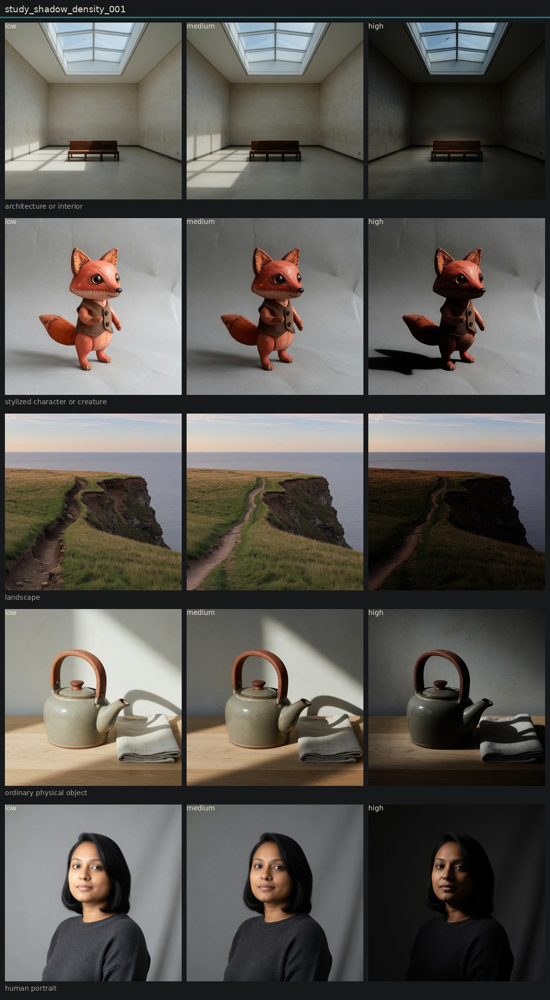

# Controlled variation of shadow density

## Metadata
- id: study_shadow_density_001
- candidate: [vec_shadow_density](../vectors/vec_shadow_density.md)
- status: complete
- date: 2026-08-13
- decision: provisional

## Protocol
Hold subject via locked anchor images. image_edit each anchor to low, medium, and high of one candidate. Do not change other dimensions on purpose.

## Hold constant
- subject identity
- pose and blocking
- framing and crop
- camera height and distance
- key light direction
- scene content
- source image when editing

## Comparison grid

## Observations
- [obs_0021](../observations/obs_0021.md) anchor_portrait low
- [obs_0022](../observations/obs_0022.md) anchor_portrait medium
- [obs_0023](../observations/obs_0023.md) anchor_portrait high
- [obs_0024](../observations/obs_0024.md) anchor_object low
- [obs_0025](../observations/obs_0025.md) anchor_object medium
- [obs_0026](../observations/obs_0026.md) anchor_object high
- [obs_0027](../observations/obs_0027.md) anchor_architecture low
- [obs_0028](../observations/obs_0028.md) anchor_architecture medium
- [obs_0029](../observations/obs_0029.md) anchor_architecture high
- [obs_0030](../observations/obs_0030.md) anchor_landscape low
- [obs_0031](../observations/obs_0031.md) anchor_landscape medium
- [obs_0032](../observations/obs_0032.md) anchor_landscape high
- [obs_0033](../observations/obs_0033.md) anchor_character low
- [obs_0034](../observations/obs_0034.md) anchor_character medium
- [obs_0035](../observations/obs_0035.md) anchor_character high

## Decision
Darks do get heavier across subjects. The instrument often restages lighting to do it, especially on the teapot (new hard key and cast shadow) and the portrait (fill removed). Architecture and landscape are closer to a tone-mapping change. Not yet canonical.

## Entanglement
- Shadow density and key-to-fill ratio move together in Imagine edits.
- Object high changed source hardness, not only density.
- Low pole sometimes flattens lighting instead of lifting only the toe.

## Next experiments
- See study_shadow_density_002 for the clean density sweep.

## Notes
