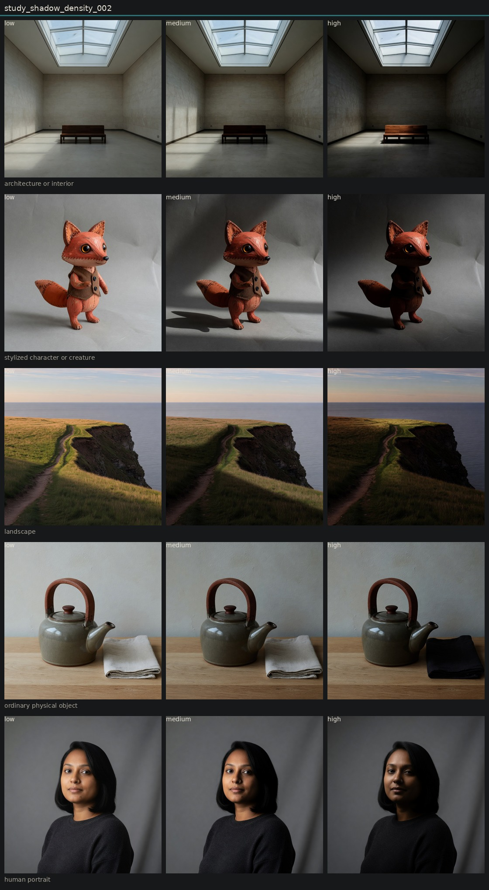

# Controlled variation of shadow density

## Metadata
- id: study_shadow_density_002
- candidate: [vec_shadow_density](../vectors/vec_shadow_density.md)
- status: complete
- date: 2026-08-14
- decision: provisional

## Protocol
Hold subject via locked anchor images. image_edit each anchor to low, medium, and high of one candidate. Do not change other dimensions on purpose.

## Hold constant
- subject identity
- pose and blocking
- framing and crop
- camera height and distance
- key light direction
- scene content
- source image when editing

## Comparison grid

## Observations
- [obs_0101](../observations/obs_0101.md) anchor_portrait low
- [obs_0102](../observations/obs_0102.md) anchor_portrait medium
- [obs_0103](../observations/obs_0103.md) anchor_portrait high
- [obs_0104](../observations/obs_0104.md) anchor_object low
- [obs_0105](../observations/obs_0105.md) anchor_object medium
- [obs_0106](../observations/obs_0106.md) anchor_object high
- [obs_0107](../observations/obs_0107.md) anchor_architecture low
- [obs_0108](../observations/obs_0108.md) anchor_architecture medium
- [obs_0109](../observations/obs_0109.md) anchor_architecture high
- [obs_0110](../observations/obs_0110.md) anchor_landscape low
- [obs_0111](../observations/obs_0111.md) anchor_landscape medium
- [obs_0112](../observations/obs_0112.md) anchor_landscape high
- [obs_0113](../observations/obs_0113.md) anchor_character low
- [obs_0114](../observations/obs_0114.md) anchor_character medium
- [obs_0115](../observations/obs_0115.md) anchor_character high

## Decision
Cleaner than 001. Portrait high inks sweater and far cheek with the key still camera-left. Teapot high does not invent a handle shadow. The napkin was recolored black. Mild fill drop remains. Distinct enough from black-level lift and from the intended ratio pole.

## Entanglement
- Object high changed napkin color (content leak).
- Portrait high still drops fill a little.

## Next experiments
- Retry object high with an explicit hold: keep the napkin the same linen color.

## Notes
