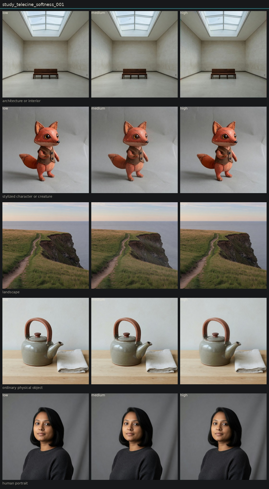

# Controlled variation of telecine softness

## Metadata
- id: study_telecine_softness_001
- candidate: [vec_telecine_softness](../vectors/vec_telecine_softness.md)
- status: complete
- date: 2026-08-14
- decision: provisional

## Protocol
Hold subject via locked anchor images. image_edit each anchor to low, medium, and high of one candidate. Do not change other dimensions on purpose.

## Hold constant
- subject identity
- pose and blocking
- framing and crop
- camera height and distance
- key light direction
- scene content
- source image when editing

## Comparison grid

## Observations
- [obs_0181](../observations/obs_0181.md) anchor_architecture high
- [obs_0182](../observations/obs_0182.md) anchor_character high
- [obs_0183](../observations/obs_0183.md) anchor_landscape high
- [obs_0184](../observations/obs_0184.md) anchor_object high
- [obs_0185](../observations/obs_0185.md) anchor_portrait high
- [obs_0191](../observations/obs_0191.md) anchor_architecture medium
- [obs_0192](../observations/obs_0192.md) anchor_character medium
- [obs_0193](../observations/obs_0193.md) anchor_landscape medium
- [obs_0194](../observations/obs_0194.md) anchor_object medium
- [obs_0195](../observations/obs_0195.md) anchor_portrait medium
- [obs_0201](../observations/obs_0201.md) anchor_architecture low
- [obs_0202](../observations/obs_0202.md) anchor_character low
- [obs_0203](../observations/obs_0203.md) anchor_landscape low
- [obs_0204](../observations/obs_0204.md) anchor_object low
- [obs_0205](../observations/obs_0205.md) anchor_portrait low

## Decision
High is flatter than optical-softness high. Portrait knit survives. Architecture shows the best transfer tell: lost stone bandwidth plus side-wall chroma smear. Object high barely moved. Distinct enough from optical melt and from analog texture.

## Entanglement
- Object high is a weak step.
- Some optical-softness rise rides along, but far below the optical-high melt.

## Next experiments
- Sequential reconstruction using vectors that earned a coefficient.

## Notes
